# 🎙️ GPT-SoVITS 語音克隆 SOP 操作手冊

> **適用對象**：林志琳聲音模型訓練與推理  
> **執行環境**：Google Colab（Tesla T4 GPU）  
> **建立日期**：2026-08-13  
> **預估總耗時**：約 15～25 分鐘

---

## 📋 目錄

1. [前置準備：Google Colab 環境部署](#前置準備google-colab-環境部署)
2. [Step 1：設定模型名稱與 GPU 確認](#step-1設定模型名稱與-gpu-確認)
3. [Step 2：資料集預處理（切片 + ASR 標註）](#step-2資料集預處理切片--asr-標註)
4. [Step 3：資料集格式化與模型訓練](#step-3資料集格式化與模型訓練)
5. [Step 4：語音合成推理（Inference）](#step-4語音合成推理inference)
6. [Step 5：匯出訓練好的模型](#step-5匯出訓練好的模型)
7. [常見問題排除](#常見問題排除)

---

## 前置準備：Google Colab 環境部署

### 1. 建立 Colab 筆記本並啟用 GPU

1. 前往 [Google Colab](https://colab.research.google.com/)，點擊 **「新建筆記本」**。
2. 點選選單 **`階段作業 (Runtime)`** ➔ **`變更階段作業類型 (Change runtime type)`**。
3. 硬體加速器選擇 **`T4 GPU`**，點擊 **儲存**。

### 2. 執行一鍵部署腳本

在 Code Cell 中貼上以下腳本並執行（點擊 ▶ 播放按鈕）：

```python
# 🚀 GPT-SoVITS 完整部署腳本 (Google Colab 專用)

# 1. 確認 GPU 掛載
!nvidia-smi

# 2. 複製 GPT-SoVITS 專案
%cd /content
!rm -rf GPT-SoVITS
!git clone https://github.com/RVC-Boss/GPT-SoVITS.git
%cd /content/GPT-SoVITS

# 3. 安裝完整依賴套件
!pip install -q -r requirements.txt
!pip install -q pypinyin g2p_en jieba opencc-python-reimplemented huggingface_hub yt-dlp whisper-openai
!npm install -g localtunnel > /dev/null 2>&1

# 4. 下載預訓練模型
from huggingface_hub import snapshot_download
import os
os.makedirs("GPT_SoVITS/pretrained_models", exist_ok=True)
snapshot_download(
    repo_id="lj1995/GPT-SoVITS",
    local_dir="GPT_SoVITS/pretrained_models",
    local_dir_use_symlinks=False
)

# 5. 下載林志琳聲音素材
youtube_url = "https://www.youtube.com/shorts/OWnWts6r7HQ"
output_dir = "lin_zhilin_voice"
os.makedirs(output_dir, exist_ok=True)
!yt-dlp -x --audio-format wav -o {output_dir}/raw_audio.wav {youtube_url}
!ffmpeg -y -i {output_dir}/raw_audio.wav -ac 1 -ar 44100 -sample_fmt s16 {output_dir}/clean_mono_44k.wav

# 6. 建立外網存取通道並啟動 WebUI
import urllib.request
ip = urllib.request.urlopen('https://ipv4.icanhazip.com').read().decode('utf8').strip()
print(f"\n🔑【Localtunnel 訪問密碼】： {ip}")
get_ipython().system_raw('lt --port 9874 > url.txt 2>&1 &')
import time; time.sleep(3)
with open('url.txt') as f:
    print("🌐【外網存取網址】：", f.read().strip())

!python webui.py
```

### 3. 開啟 WebUI

- 執行完成後，日誌會輸出 **`🌐【外網存取網址】`** 的 `.loca.lt` 連結。
- 點擊連結後，在 Localtunnel 密碼頁輸入日誌中的 **IP 位址**，按 Submit 即可進入 WebUI。

---

## Step 1：設定模型名稱與 GPU 確認

> ⏱️ 預估耗時：30 秒

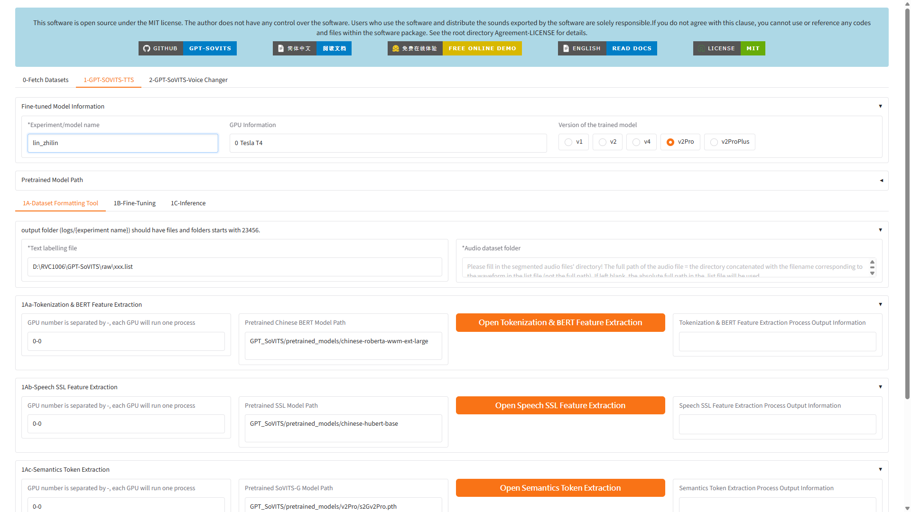

### 操作步驟

1. 進入 WebUI 後，點擊上方的 **`1-GPT-SOVITS-TTS`** 頁籤。
2. 在 **`Fine-tuned Model Information`** 區塊中，找到 **`*Experiment/model name`** 輸入框。
3. 將預設值 `xxx` **清空**，輸入：

   ```
   lin_zhilin
   ```

4. 確認右側 **`GPU Information`** 顯示 **`0 Tesla T4`**（代表 GPU 已正確掛載）。
5. **`Version of the trained model`** 選擇 **`v2Pro`**（推薦，效果最佳）。

> [!IMPORTANT]
> 模型名稱不要包含空格或中文字元，建議使用英文底線命名（如 `lin_zhilin`）。

---

## Step 2：資料集預處理（切片 + ASR 標註）

> ⏱️ 預估耗時：3～5 分鐘

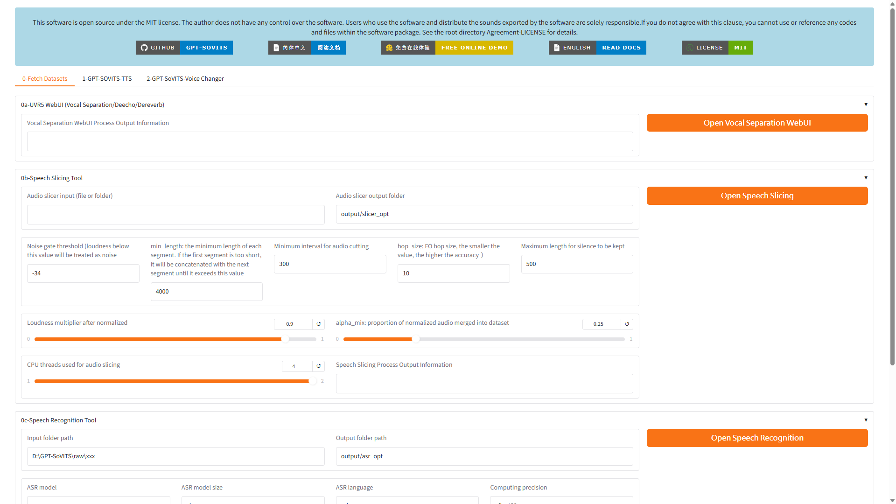

### 操作步驟

#### 2-1. 切換到資料集頁籤

1. 點擊上方的 **`0-Fetch Datasets`** 頁籤。
2. 頁面會顯示四個區塊：`0a-UVR5`、`0b-Speech Slicing Tool`、`0c-Speech Recognition Tool`、`0d-Proofreading Tool`。

#### 2-2. 設定音訊來源路徑

1. 在 **`0b-Speech Slicing Tool`** 區塊中，找到 **`Audio slicer input (file or folder)`** 輸入框。
2. 填入林志琳音訊檔在 Colab 上的路徑：

   ```
   /content/GPT-SoVITS/lin_zhilin_voice
   ```

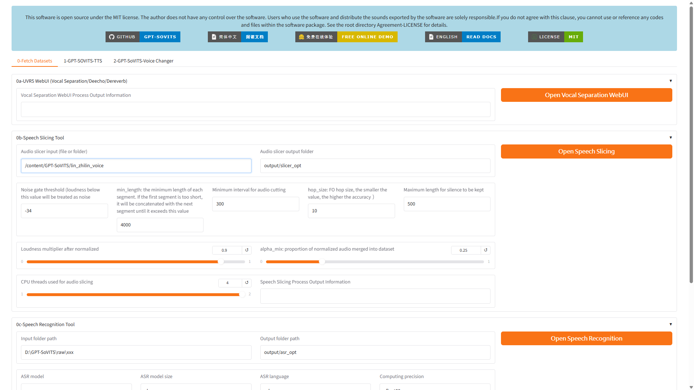

#### 2-3. 執行人聲分離（可選）

1. 如果原始音訊混有背景音樂或雜音，點擊 **`Open Vocal Separation WebUI`** 橘色按鈕。
2. *如果原始音訊已經是乾淨人聲，可跳過此步驟。*

#### 2-4. 音訊自動切片

1. 點擊 **`Open Speech Slicing`** 橘色按鈕。
2. 系統會自動將長音訊切分為 2～8 秒的短片段。
3. 等待右側 **`Speech Slicing Process Output Information`** 區域顯示處理完成訊息。

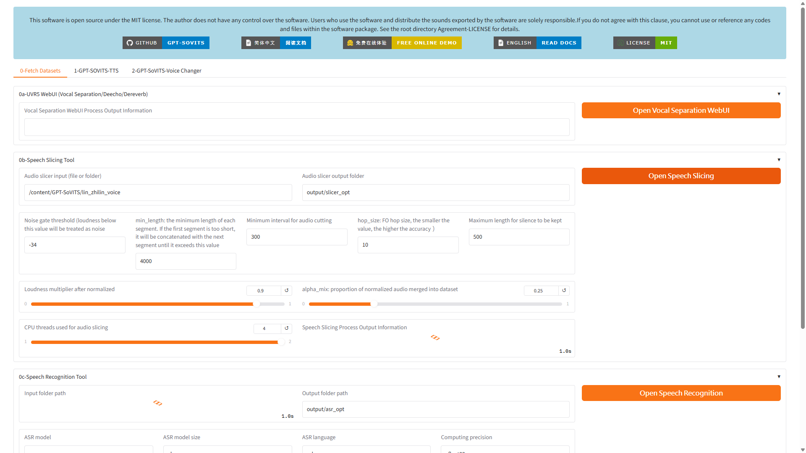

> [!TIP]
> 切片後的音檔會自動存放在 `output/slicer_opt/` 目錄下。

#### 2-5. Whisper 自動語音辨識（ASR）

1. 在 **`0c-Speech Recognition Tool`** 區塊中：
   - **`Input folder path`** 輸入框填入切片後音檔的路徑。
   - **`ASR language`** 選擇 **`zh`**（中文）。
   - **`ASR model size`** 建議選擇 **`large`**。
2. 點擊 **`Open Speech Recognition`** 橘色按鈕。
3. 等待 **`Speech Recognition Process Output Information`** 區域顯示完成訊息。

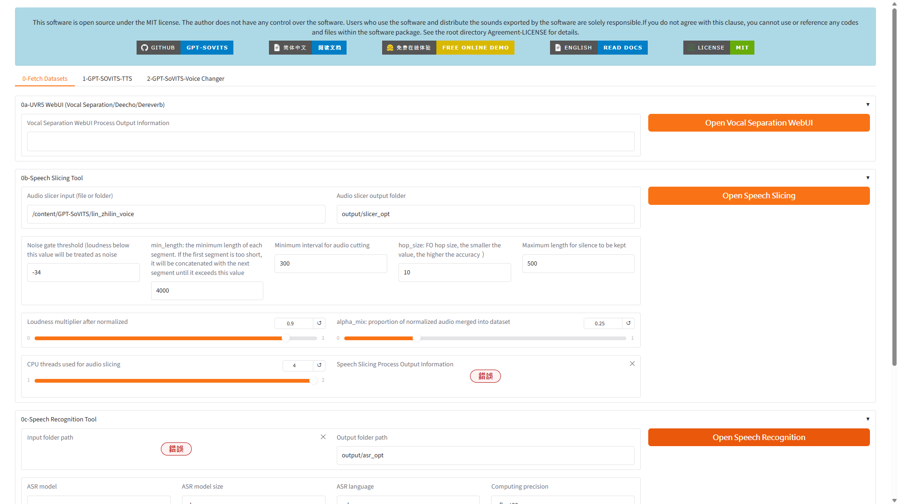

> [!IMPORTANT]
> ASR 完成後，系統會自動在 `output/asr_opt/` 下生成 `.list` 標註檔。後續步驟會自動引用此檔案。

---

## Step 3：資料集格式化與模型訓練

> ⏱️ 預估耗時：8～15 分鐘

### 3-A. 資料集格式化（1A-Dataset Formatting Tool）

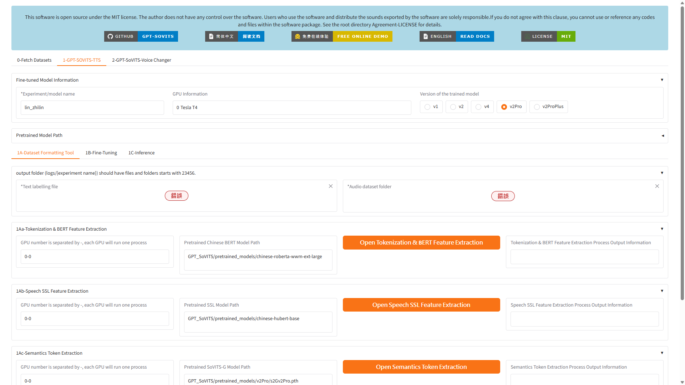

1. 點擊上方 **`1-GPT-SOVITS-TTS`** 頁籤，再點擊子頁籤 **`1A-Dataset Formatting Tool`**。
2. 確認以下欄位：
   - **`*Text labelling file`**：應指向 ASR 產生的 `.list` 檔案路徑。
   - **`*Audio dataset folder`**：應指向切片後的音檔目錄。

3. 依序點擊以下三個特徵提取按鈕（每個都要等待完成後再按下一個）：

| 順序 | 按鈕名稱 | 說明 |
|------|----------|------|
| ① | **`Open Tokenization & BERT Feature Extraction`** | BERT 中文語義特徵提取 |
| ② | **`Open Speech SSL Feature Extraction`** | SoVITS 語音 SSL 特徵提取 |
| ③ | **`Open Semantics Token Extraction`** | 語義 Token 提取 |

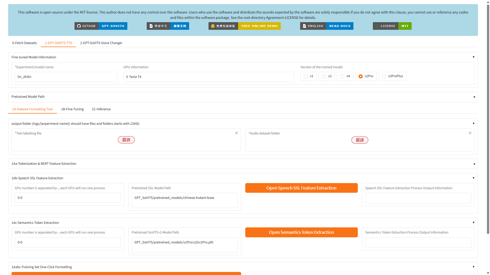

> [!WARNING]
> 三個特徵提取步驟必須**依序執行**，每個步驟完成後才能按下一個。觀察右側的 Output Information 區域確認完成狀態。

### 3-B. 模型訓練（1B-Fine-Tuning）

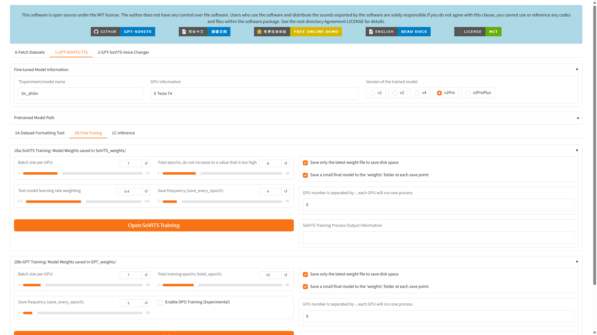

1. 切換至子頁籤 **`1B-Fine-Tuning`**。

#### SoVITS 訓練（1Ba）

2. 在 **`1Ba-SoVITS Training`** 區塊中設定：

| 參數 | 建議值 | 說明 |
|------|--------|------|
| Batch size per GPU | `7` | T4 GPU 預設值即可 |
| Total epochs | `8` | 短音訊 8 輪即可 |
| Save frequency | `4` | 每 4 個 epoch 儲存模型 |

3. 點擊 **`Open SoVITS Training`** 橘色按鈕。
4. 等待右側 **`SoVITS Training Process Output Information`** 顯示訓練完成。

#### GPT 訓練（1Bb）

5. 在 **`1Bb-GPT Training`** 區塊中設定：

| 參數 | 建議值 | 說明 |
|------|--------|------|
| Batch size per GPU | `7` | 預設值 |
| Total training epochs | `15` | GPT 模型需要更多輪次 |
| Save frequency | `5` | 每 5 個 epoch 儲存 |

6. 點擊 **`Open GPT Training`** 橘色按鈕（需向下捲動頁面才能看到）。
7. 等待訓練完成。

> [!WARNING]
> 訓練過程中**請勿關閉 Colab 頁面**或讓筆電進入休眠，否則 GPU 連線會中斷。
> 兩階段訓練在 T4 GPU 上分別約需 2～5 分鐘。

---

## Step 4：語音合成推理（Inference）

> ⏱️ 預估耗時：1～2 分鐘

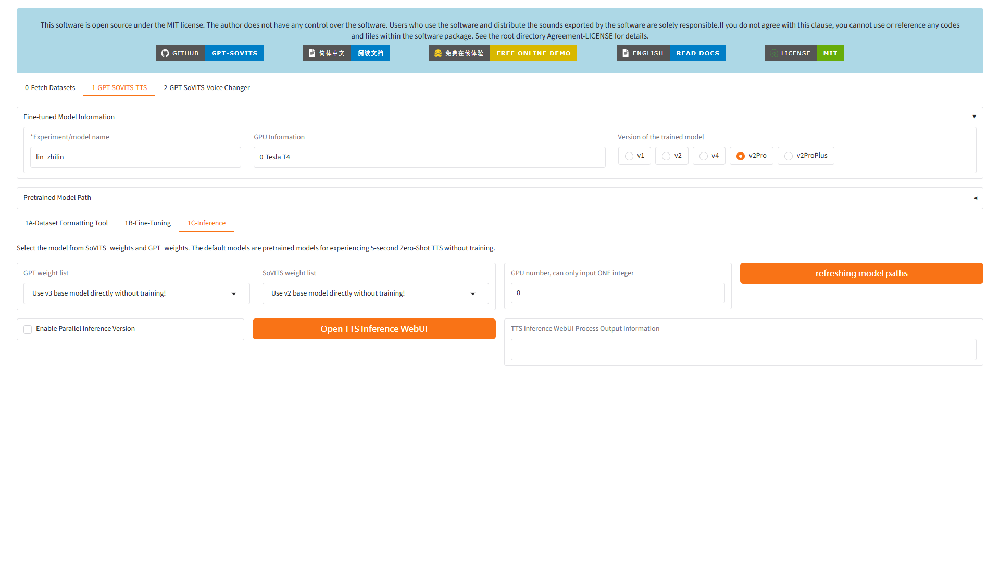

### 操作步驟

#### 4-1. 載入訓練好的模型

1. 切換至子頁籤 **`1C-Inference`**。
2. 點擊右側 **`refreshing model paths`** 橘色按鈕，重新整理模型列表。

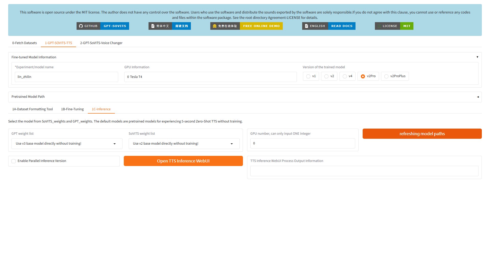

3. 在 **`GPT weight list`** 下拉選單中，選擇訓練好的模型（包含 `lin_zhilin` 字樣）。
4. 在 **`SoVITS weight list`** 下拉選單中，選擇對應的 SoVITS 模型。
   - 如果尚未訓練，可先選 **`Use v3 base model directly without training!`** 進行 Zero-Shot 測試。

#### 4-2. 開啟 TTS 推理介面

1. 點擊 **`Open TTS Inference WebUI`** 橘色按鈕。
2. 等待下方 **`TTS Inference WebUI Process Output Information`** 顯示啟動成功。

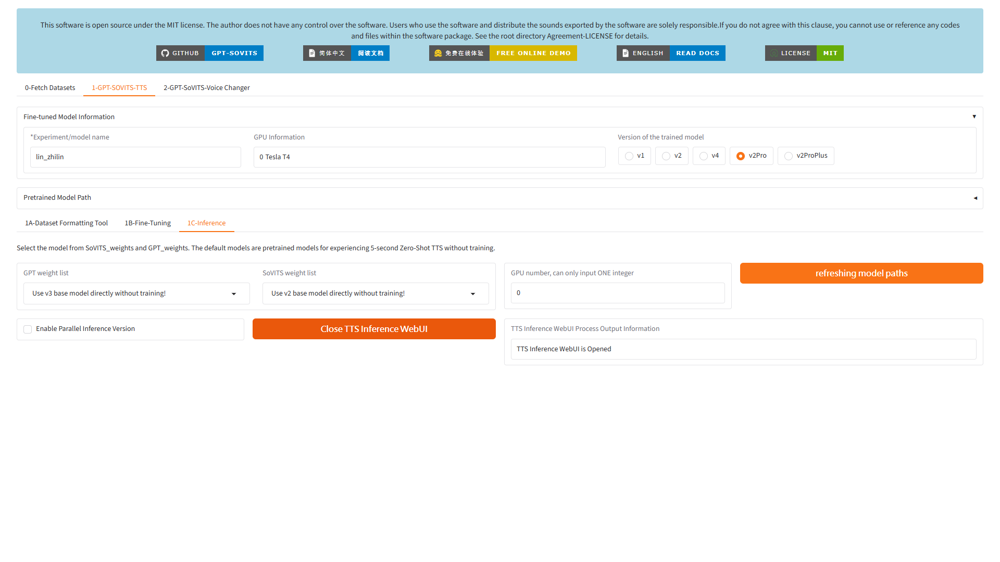

#### 4-3. 設定參考音訊與合成

在開啟的 TTS 推理介面中：

1. **Reference Audio（參考音訊）**：上傳一段 3～10 秒的林志琳語音片段。
   - 可使用 `output/slicer_opt/` 下的任意切片音檔。
2. **Reference Text（參考文字）**：填入該參考音訊中所說的文字。
3. **Language（語言）**：選擇 **`中文`**。
4. **Target Text（目標文字）**：輸入你想讓林志琳說的話：

   ```
   大家好，我是志琳，今天天氣真好！歡迎收看北風與太陽的故事。
   ```

5. 點擊 **`Start Inference（開始合成）`** 按鈕。
6. 等待幾秒鐘後，下方會出現音訊播放器，可試聽合成結果並下載。

> [!TIP]
> 如果合成效果不夠自然，可以嘗試：
> - 更換不同的參考音訊片段
> - 調整 **Top-K** 和 **Top-P** 參數（降低可使語調更穩定）
> - 增加訓練的 Epochs 數量（回到 Step 3 重新訓練）

---

## Step 5：匯出訓練好的模型

訓練完成的模型檔案位於 Colab 雲端的以下路徑：

```
/content/GPT-SoVITS/SoVITS_weights/lin_zhilin/
/content/GPT-SoVITS/GPT_weights/lin_zhilin/
```

### 下載模型到本機

在 Colab 新建一個 Code Cell，執行：

```python
from google.colab import files
import shutil

# 打包模型為 zip
shutil.make_archive('/content/lin_zhilin_model', 'zip', '/content/GPT-SoVITS/SoVITS_weights/')
shutil.make_archive('/content/lin_zhilin_gpt_model', 'zip', '/content/GPT-SoVITS/GPT_weights/')

# 自動下載到本機
files.download('/content/lin_zhilin_model.zip')
files.download('/content/lin_zhilin_gpt_model.zip')
```

> [!IMPORTANT]
> Google Colab 的免費 GPU 有時間限制（通常約 4 小時）。請在訓練完成後盡快匯出模型，避免因斷線而遺失。

---

## 常見問題排除

### ❌ `ModuleNotFoundError: No module named 'pypinyin'`
**原因**：依賴套件未完整安裝。  
**解決**：在 Colab 執行 `!pip install pypinyin g2p_en jieba`。

### ❌ `No Such Model: pretrained_models/...`
**原因**：預訓練模型未下載完成。  
**解決**：重新執行 `snapshot_download()` 段落的程式碼。

### ❌ WebUI URL 打不開 (`http://0.0.0.0:9874`)
**原因**：這是 Colab 內部 IP，需要透過外網通道存取。  
**解決**：使用 Localtunnel 或在 `webui.py` 啟動指令加上 `--share` 參數。

### ❌ Localtunnel 頁面要求輸入密碼
**原因**：Localtunnel 安全機制。  
**解決**：在 Colab 日誌中找到 `🔑【Localtunnel 訪問密碼】` 的 IP 位址，貼入密碼框並提交。

### ❌ 合成的聲音不像目標人物
**可能原因與解決方案**：
- 參考音訊品質不佳 → 選擇更清晰、無雜音的音訊片段
- 訓練資料量不足 → 增加更多語音素材（建議至少 1～3 分鐘純人聲）
- Epoch 不夠 → 將訓練 Epochs 增加到 20～30

---

> **文件維護**：本 SOP 由 Carrot Video 專案團隊維護。  
> **相關檔案**：[voice_profile.json](../../public/voice/林志琳/voice_profile.json) · [vits_train_pipeline.py](../../scripts/vits_train_pipeline.py) · [Playwright 自動化腳本](../../scripts/gpt_sovits_sop_screenshots.py)
